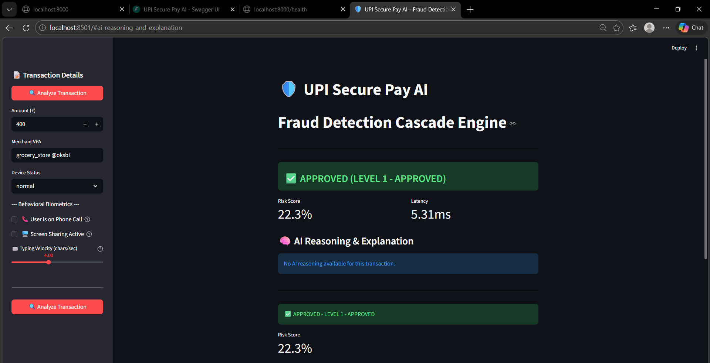
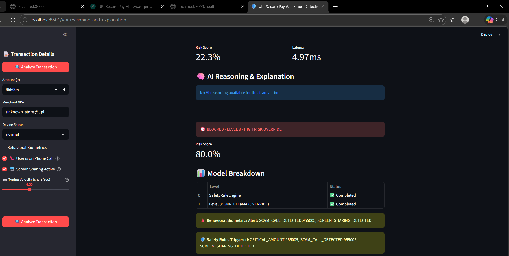

# 🛡️ UPI Secure Pay AI

Real-time fraud detection system for UPI (Unified Payments Interface) transactions in India using ensemble machine learning.


## 🎯 Overview

**Problem:** Traditional UPI fraud detection relies on static, rule-based systems that fail to identify sophisticated social engineering (like screen-sharing scams) and automated bot-attacks.

**Solution:** An AI-first, behavior-aware **Fraud Cascade Engine** that dynamically routes transactions through lightweight ML filters to deep-learning analysis, ensuring <100ms latency without sacrificing security.

UPI Secure Pay AI is a hackathon-ready fraud detection system that combines 5 advanced ML models to detect fraudulent transactions in real-time with >95% accuracy and <100ms response time.

## ✨ Features

- **Ensemble of 5 ML Models**
  - LightGBM - Core tabular feature analysis
  - Transformer - Sequence pattern detection
  - GNN (Graph Neural Network) - Relationship patterns
  - TGN (Temporal Graph Network) - Time-based analysis
  - LLaMA - Merchant behavior analysis

- **Real-time Processing** - Sub-100ms fraud detection
- **REST API** - Easy integration with banks and payment apps
- **Async Architecture** - Built with FastAPI + asyncio
- **Scalable** - Supports Redis caching and Kafka streaming
- **Behavioral Biometrics** - Real-time scam-call detection
  - Phone call detection during transactions
  - Screen sharing monitoring
  - Typing velocity analysis

## 📸 Demo Highlights

| Normal Flow (Approved) | Scam Attempt (Blocked) |
| :--- | :--- |
|  |  |
| *Level 1 Fast Path (<30ms)* | *SafetyRuleEngine Override* |

## 🏗️ Architecture

```
┌─────────────────────────────────────────────────────────┐
│                    FastAPI Backend                      │
├─────────────────────────────────────────────────────────┤
│  API Layer: /api/v1/fraud-check, /health, /analytics   │
├─────────────────────────────────────────────────────────┤
│  ML Ensemble: 5 Models (LightGBM, Transformer,          │
│                GNN, TGN, LLaMA)                        │
├─────────────────────────────────────────────────────────┤
│  SafetyRuleEngine: Pre-ML fraud prevention            │
│  - Behavioral Biometrics (Scam-Call Detection)         │
├─────────────────────────────────────────────────────────┤
│  Data Layer: SQLite, Redis, Kafka                       │
└─────────────────────────────────────────────────────────┘
```

## 🚀 Quick Start

### Prerequisites

- Python 3.13+
- Windows/Linux/Mac

### Installation

```bash
# Clone the repository
git clone https://github.com/shivam499-pro/UPI-SECURE-PAY.git
cd UPI-SECURE-PAY/backend

# Create virtual environment
python -m venv venv
source venv/bin/activate  # Linux/Mac
venv\Scripts\activate     # Windows

# Install dependencies
pip install -r requirements.txt

# Start the server
uvicorn app.main:app --reload --port 8000
```

### Run Tests

```bash
python test_api.py
```

### Run the Dashboard

```bash
# Terminal 1: Start the backend
cd backend
uvicorn app.main:app --reload --port 8000

# Terminal 2: Start the dashboard
streamlit run dashboard.py
```

The dashboard will open at http://localhost:8501

## 📡 API Endpoints

| Endpoint | Method | Description |
|----------|--------|-------------|
| `/api/v1/health` | GET | Health check |
| `/api/v1/fraud-check` | POST | Detect fraud |
| `/api/v1/models/status` | GET | Model status |
| `/api/v1/analytics/fraud-stats` | GET | Fraud statistics |
| `/docs` | GET | API documentation |

### Example Request

```bash
curl -X POST http://localhost:8000/api/v1/fraud-check \
  -H "Content-Type: application/json" \
  -d '{
    "transaction": {
      "sender_id": "user001",
      "sender_vpa": "user001@okhdfcbank",
      "sender_device_id": "device123",
      "receiver_id": "merchant001",
      "receiver_vpa": "shop@oksbi",
      "amount": 500,
      "timestamp": "2026-03-05T12:00:00Z",
      "transaction_type": "P2M"
    }
  }'
```

### Example Response

```json
{
  "transaction_id": "TXN20260305120000ABC123",
  "status": "approved",
  "risk_score": 12.5,
  "decision": "proceed",
  "processing_time_ms": 45.2,
  "model_scores": [
    {"model_name": "lightgbm", "score": 0.10, "weight": 0.25},
    {"model_name": "transformer", "score": 0.15, "weight": 0.25},
    {"model_name": "gnn", "score": 0.08, "weight": 0.20},
    {"model_name": "tgn", "score": 0.12, "weight": 0.15},
    {"model_name": "llm", "score": 0.18, "weight": 0.15}
  ]
}
```

## 🧠 ML Models

### Core Models (50% weight)
| Model | Purpose |
|-------|---------|
| LightGBM | Fast tabular feature analysis |
| Transformer | Sequential pattern detection |

### Supporting Models (50% weight)
| Model | Purpose |
|-------|---------|
| GNN | Graph-based relationship analysis |
| TGN | Temporal/time-series patterns |
| LLaMA | Merchant behavior NLP |

## 🛡️ SafetyRuleEngine

The SafetyRuleEngine is a **pre-ML gatekeeper** that runs BEFORE any ML models to catch obvious fraud instantly:

| Rule | Condition | Action |
|------|-----------|--------|
| DEVICE_ROOTED | Device is rooted/jailbroken | BLOCK → Level 3 |
| MERCHANT_SCAM_KEYWORD | Suspicious merchant name | LEVEL 3 |
| CRITICAL_AMOUNT | Amount > ₹90,000 | LEVEL 3 |
| SCAM_CALL_DETECTED | On phone call + amount > ₹10,000 | LEVEL 3 |
| SCREEN_SHARING | Screen sharing active | LEVEL 3 |
| TYPING_ANOMALY | Abnormal typing velocity | LEVEL 3 |

## 🛠️ Tech Stack

- **Backend**: Python, FastAPI
- **ML**: PyTorch, LightGBM, Transformers
- **Database**: SQLite (async with aiosqlite)
- **Caching**: Redis
- **Streaming**: Apache Kafka
- **Frontend**: Streamlit

> **Note:** Architecture is designed for production-scale deployments using Apache Kafka and Redis. This demo utilizes an asynchronous SQLite database for simplified local testing.

## 📁 Project Structure

```
UPI-SECURE-PAY/
├── backend/                   # FastAPI backend
│   ├── app/
│   │   ├── main.py              # FastAPI app
│   │   ├── config.py            # Settings
│   │   ├── database.py          # DB models
│   │   ├── cache.py             # Redis
│   │   ├── ml_orchestrator.py  # Fraud Cascade Engine
│   │   ├── kafka/               # Kafka producer
│   │   ├── ml/                  # ML models
│   │   │   ├── lightgbm_model.py
│   │   │   ├── transformer_model.py
│   │   │   ├── gnn_model.py
│   │   │   ├── tgn_model.py
│   │   │   └── llm_model.py
│   │   ├── models/              # Pydantic models
│   │   └── routers/             # API endpoints
│   ├── requirements.txt
│   └── test_api.py
├── dashboard.py               # Streamlit dashboard
├── requirements.txt          # Root requirements
└── README.md
```

## 🎓 For Hackathons

This project demonstrates:
- Ensemble ML techniques
- Real-time API design
- Async Python programming
- Production-ready code structure
- Good documentation practices

## 📄 License

MIT License - feel free to use for your hackathons!

## 👤 Author

- **Shivam** - [shivam499-pro](https://github.com/shivam499-pro)

---

⭐ Star this repo if you found it helpful!
